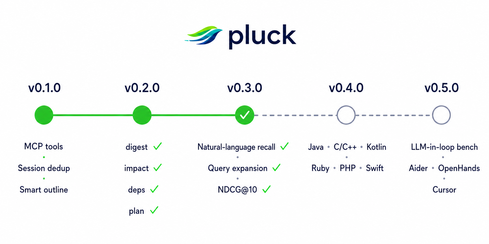

<h2 align="center">
  <!-- GPT IMAGE PROMPT: A sleek, modern logo for 'pluck', an AI code search tool. The logo should feature a stylized bird or feather motif, or a fast-moving abstract shape, with a clean tech-focused aesthetic. Use vibrant green and dark blue tones. Transparent background. -->
  <br/>
  AI 코딩 에이전트를 위한 MCP-네이티브 코드 검색기<br/>
  <sub>웜 검색 0.07 ms · 파일 저장 → 검색 가능 171 ms · CI 로그 압축 71 % — 모든 수치는 <a href="benchmarks/baseline.json"><code>benchmarks/baseline.json</code></a>의 게이트된 값이에요</sub>
</h2>

<div align="center">
  <h2>
    <a href="https://crates.io/crates/pluck-mcp"></a>
    <a href="https://github.com/hunhee98/pluck/blob/main/LICENSE">
      
    </a>
    <a href="https://www.rust-lang.org"></a>
  </h2>

[빠른 시작](#빠른-시작) •
[왜 pluck을 써야 할까요?](#왜-pluck을-써야-할까요) •
[MCP 툴](#mcp-툴) •
[CLI](#독립-실행-cli-에이전트-없이) •
[성능 및 토큰 절감](#성능-및-토큰-절감-효과)

</div>

**pluck**은 AI 에이전트가 코드를 읽고 검색할 때 사용하는 `cat`과 `grep`을 대체하는 로컬 Rust 데몬이에요. MCP(Model Context Protocol)를 통해 심볼(Symbol)을 인식해서 코드를 읽고 검색할 수 있게 해줘요. 1밀리초 미만의 빠른 웜 검색, AST 기반 청크화, 세션 중복 제거를 제공하면서, 모든 툴에 `--raw` 폴백을 제공해 에이전트가 pluck을 기본으로 써도 기능 손실이 전혀 없어요.

```
pluck 없이:  ls → grep → cat file1 → cat file2 → cat file3 → ...
pluck 사용:  pluck.plan "auth-token 만료 버그 수정" → 다음 3-5 retrieval 호출 추천
             pluck.search "auth flow"            → BM25 + 시맨틱으로 랭킹된 청크
             pluck.peek validate_token           → 시그니처 + 호출 함수만
             pluck.symbol validate_token         → 해당 함수 본문만
             pluck.impact validate_token         → 모든 호출자, depth 제한
             pluck.deps src/auth/login.ts        → 정/역방향 import 그래프
             pluck.digest < cargo-build.log      → 71% 짧게, 에러는 그대로
```

## 빠른 시작

`pluck`은 AI 코딩 에이전트의 기본 검색 도구로 사용되도록 만들어졌어요.

### 1. pluck 설치하기

```bash
# crates.io에서 데몬 + 독립 실행형 CLI 설치
cargo install pluck-mcp pluck-cli

# 또는 Homebrew tap을 통해 설치
brew tap hunhee98/pluck && brew install pluck
```

### 2. 에이전트에 추가하기

**Claude Code**
```bash
pluck init --target claude
```
*(수동으로 추가하려면 `/plugin marketplace add hunhee98/pluck`을 입력해도 돼요)*

**Codex**
```bash
pluck init --target codex
```

## 왜 pluck을 써야 할까요?

AI 에이전트가 기존의 `cat`이나 `grep`으로 코드를 탐색하면 정말 많은 토큰을 낭비하게 돼요. 같은 코드를 반복해서 읽거나, 상관없는 함수까지 스크롤하고, 똑같은 import 구문을 매번 읽다 보면 한 세션에서만 수천 개의 토큰이 버려지거든요.

`pluck`은 에이전트를 위한 전용 코드 검색 계층을 제공해서 이 문제를 해결해요. 핵심은 **에이전트가 코드를 검색할 때 무조건 `pluck`을 기본으로 사용하게 만드는 것**이에요. Bash는 `pluck`이 도와줄 수 없는 경우(예: 바이너리 파일이나 레포지토리 밖의 경로)에만 사용하는 최후의 수단이죠.

- **스마트 아웃라인 (`pluck.read`)**: 1,000줄짜리 파일을 통째로 주는 대신, 시그니처만 포함된 효율적인 아웃라인을 반환해요. 에이전트는 여기서 필요한 함수 본문만 쏙쏙 골라올 수 있어요.
- **세션 중복 제거 (Session Dedup)**: 에이전트가 "auth"를 검색하고 나중에 "token"을 검색했을 때 겹치는 코드가 있다면, 단 1토큰짜리 플레이스홀더(`[already-shown: ...]`)로 대체해요. 이미 에이전트가 알고 있는 내용을 반복해서 알려줄 필요는 없으니까요.
- **기본적으로 무손실 (Lossless Default)**: 주석을 지우거나 타입을 없애면 에이전트의 판단력이 떨어질 수 있어요. `pluck`은 원본 바이트를 그대로 유지하고, 코드를 축약하는 기능은 원할 때만 켜서 사용할 수 있어요.
- **100% 역량 보장**: 모든 pluck 도구에는 `cat`이나 `grep`과 바이트 단위로 정확히 동일하게 동작하는 `--raw` 폴백 옵션이 있어요.

## 작동 원리

pluck은 Tree-sitter를 사용해 파일을 AST 단위로 청크화해요. 에이전트가 쿼리를 보내면 BM25 (키워드)와 `model2vec` 스타일 정적 임베딩 ([`potion-code-16M`](https://huggingface.co/minishlab/potion-code-16M))을 RRF(reciprocal-rank fusion)로 결합해 청크의 순위를 매겨요. 덕분에 에이전트는 변수명을 정확히 몰라도 "결제 흐름" 같은 개념으로 검색할 수 있어요.

<!-- GPT IMAGE PROMPT: A clean, modern architectural diagram showing how 'pluck' works. It should show 'Source files' going into 'Tree-sitter AST chunking', splitting into 'tantivy BM25F index' and 'static model2vec embedding (potion-code-16M)'. These feed into an 'in-RAM index' managed by 'pluckd MCP daemon'. An 'Agent query' comes in, goes through 'BM25 + semantic RRF', 'Noise cutoff', 'Session dedup', and finally returns a 'Ranked snippet'. Use a dark theme with neon green and blue accents. -->
<p align="center">
  
</p>

### 세션 중복 제거 동작

<!-- GPT IMAGE PROMPT: A sequence diagram illustrating 'Session dedup'. An 'Agent' asks 'pluckd' for "auth token". pluckd returns Chunk A (420 tokens) and Chunk B (380 tokens). Later, the Agent asks for "session expiry". pluckd realizes Chunk A was already sent, so it returns a 1-token placeholder [already-shown: chunk A] along with a new Chunk C (340 tokens). The diagram should visually highlight the "Saved 419 tokens" aspect. -->
<p align="center">
  
</p>

## MCP 툴

에이전트는 필요에 따라 특정 툴을 호출해요. Bash는 기본값이 아니라 최후의 수단(fallback)이랍니다.

| 툴 (와이어명) | 대체 대상 | 사용 시점 |
|---------------|-----------|-----------|
| `mcp__pluck__read` | `cat` | 코드 파일 읽기 (기본은 스마트 아웃라인; `raw: true`로 설정하면 바이트 단위로 정확히 읽어와요) |
| `mcp__pluck__grep` | `grep` / `rg` | 키워드 검색 (모든 ripgrep 플래그를 래핑했어요) |
| `mcp__pluck__search` | — | 랭킹된 청크 검색 (BM25 + 시맨틱 RRF) |
| `mcp__pluck__symbol` | `cat` + 스크롤 | 특정 함수/클래스만 쏙쏙 읽어오기 |
| `mcp__pluck__peek` | — | 시그니처 + 직접 호출되는 요소(callee)만 확인 |
| `mcp__pluck__expand` | 여러 번의 `cat` | 심볼 + N홉까지의 호출 체인(callee) 확인 |
| `mcp__pluck__impact` | grep + 호출자마다 read | 역방향 호출 그래프 — "이 심볼을 누가 호출해?" |
| `mcp__pluck__deps` | grep imports + 파일마다 read | 파일 단위 import 그래프 — "이 파일이 뭘 의존하나? / 누가 import하나?" |
| `mcp__pluck__digest` | `cargo build`/`pytest`/CI 로그를 `cat`으로 파이프 | 장황한 도구 출력을 압축 (에러/패닉은 그대로, 진행 로그는 카운트로 축약) |
| `mcp__pluck__plan` | 추측성 `search`/`read` 반복 | 자유 형식 task를 받아 다음 3-5 retrieval 호출 + confidence 지표 추천 |

## 독립 실행 CLI (에이전트 없이)

터미널에서 직접 pluck을 사용할 수도 있어요:

```bash
pluck index .
pluck search "auth flow" --repo .
pluck read src/auth/login.ts        # 스마트 아웃라인
pluck read src/auth/login.ts --raw  # 바이트 단위 cat과 동일
```

## 성능 및 토큰 절감 효과

이 페이지의 모든 수치는 동결된 baseline 행 또는 실측 시나리오를 인용해요. 추정 / 희망 수치는 쓰지 않아요.

<!-- GPT IMAGE PROMPT: A bar chart comparing token usage per session between "bash (rg+cat)" and "pluck". The "bash" bar should be high and colored red or gray. The "pluck" bar should be lower and colored bright green. The title should be "Tokens per session". Clean, modern UI style. -->
<p align="center">
  
</p>

### 게이트된 엔진 메트릭

[`benchmarks/baseline.json`](benchmarks/baseline.json)에 동결된 불변값이에요. 엔진 코어를 건드리는 모든 커밋은 `scripts/regression-gate.py`로 검사하고, tolerance를 벗어나면 빌드가 막혀요.

| 메트릭 | 값 | `baseline.json`의 row |
|--------|-----|-----------------------|
| Chunker p50 (medium, 500줄) | **1.05 ms** | `chunker_medium_ms_p50` |
| Indexer 처리량 (medium, 500 파일) | **2 747 files/s** | `indexer_files_per_sec_medium` |
| 웜 검색 p50 (medium) | **0.07 ms** | `warm_search_p50_ms_medium` |
| 파일 저장 → 검색 가능 p50 | **171 ms** | `freshness_p50_ms_medium` |
| 세션 중복 제거 절감률 (5-쿼리 벤치) | **23 %** | `session_dedup_session_savings_pct` |
| `pluck.digest` 로그 압축률 (6개 fixture 중앙값) | **71 %** | `digest_savings_pct` |

### 실측 단일 시나리오 토큰 절감

`fix-auth-token-expiry`: 동일한 JIRA 스타일 작업을 bash 워크플로(`rg -l` + 여러 `cat`) vs pluck 워크플로(`search` + `read` + `symbol`)로 수행. 둘 다 같은 버그를 같은 결론으로 고침:

| 러너 | 사용 토큰 | 출처 |
|------|-----------|------|
| bash (`rg + cat`) | 1 248 | [`fix-auth-token-expiry-1778750775.json`](benchmarks/results/fix-auth-token-expiry-1778750775.json) |
| **pluck** (`search + read + symbol`) | **931 (−25 %)** | 동일 파일 |

`fix` / `refactor` / `explore` / `search` / `review` 시나리오 전반에 걸친 LLM-in-the-loop 측정은 v0.5.0 작업으로 잡혀 있어요. 측정되기 전엔 적지 않아요.

### 기능(Capability) 비교

| 기능 | `cat` + `grep` / `rg` | 다른 코드 검색 도구 | **pluck** |
|------------|----------------------|-------------------------|-----------|
| Hybrid BM25 + 시맨틱 랭킹 | ✗ | 대체로 ✓ | ✓ |
| AST 수준 청크 분할 | ✗ | 대체로 ✓ | ✓ |
| 영구 데몬 (MCP stdio) | — | ✗ (호출 시마다 콜드 CLI 실행) | **✓** |
| 영구 디스크 인덱스 (mmap) | — | 대체로 ✗ | ✗ — 로드맵 (SOON) |
| 증분 재색인 (파일 감시자) | — | 대체로 ✗ | **✓ — 171 ms p50** |
| **세션 범위 내 중복 제거** | — | ✗ | **✓ — 벤치 기준 23 % 절감** |
| **`--raw` cat/grep 바이트 동등성** | — | ✗ | **✓** |
| **기본적으로 무손실, 옵션으로 손실 모드 제공** | — | 도구마다 다름 | **✓** |
| `peek` (시그니처 + 직접 호출 요소) | ✗ | ✗ | **✓** |
| 단일 파일 아웃라인 (`pluck.read`) | ✗ | ✗ | **✓** |
| 다중 홉 `expand` (호출 그래프) | ✗ | ✗ | **✓** |
| 역방향 호출 그래프 (`impact`) | ✗ | ✗ | **✓** |
| 파일 단위 import 그래프 (`deps`) | ✗ | ✗ | **✓** |
| 빌드 / CI / 테스트 로그 압축 (`digest`) | ✗ | ✗ | **✓ — 중앙값 71 %** |
| 탐색 추천기 (`plan`) | ✗ | ✗ | **✓** |

## 로드맵

<p align="center">
  
</p>

- **v0.1.0**: crates.io 첫 발행, MCP 툴, 세션 중복 제거, 스마트 아웃라인.
- **v0.2.0**: 확장된 검색 표면 — ✅ `digest`, ✅ `impact`, ✅ `deps`, ✅ `plan`.
- **v0.3.0**: 자연어 리콜 품질 — 쿼리 확장, 2단계 cascade, NDCG@10 측정.
- **v0.4.0**: 언어 커버리지 — Java, C / C++, Kotlin, Ruby, PHP, Swift.
- **v0.5.0**: 채택률 카운터, 툴 설명 A/B 하네스, LLM-in-loop 벤치, Aider / OpenHands / Cursor hook.

## 라이선스

MIT — 자세한 내용은 [LICENSE](LICENSE)를 참고하세요.
