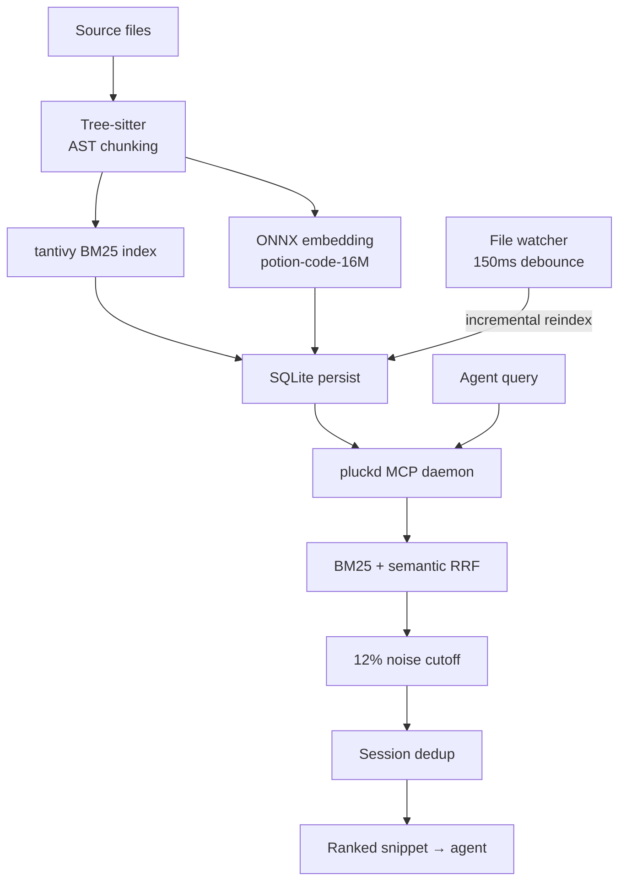
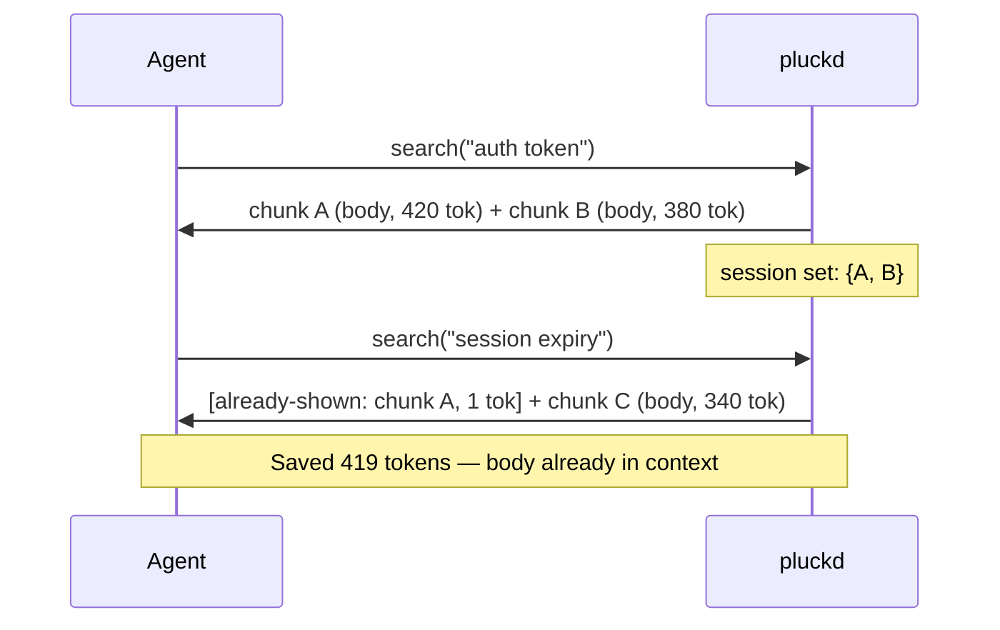
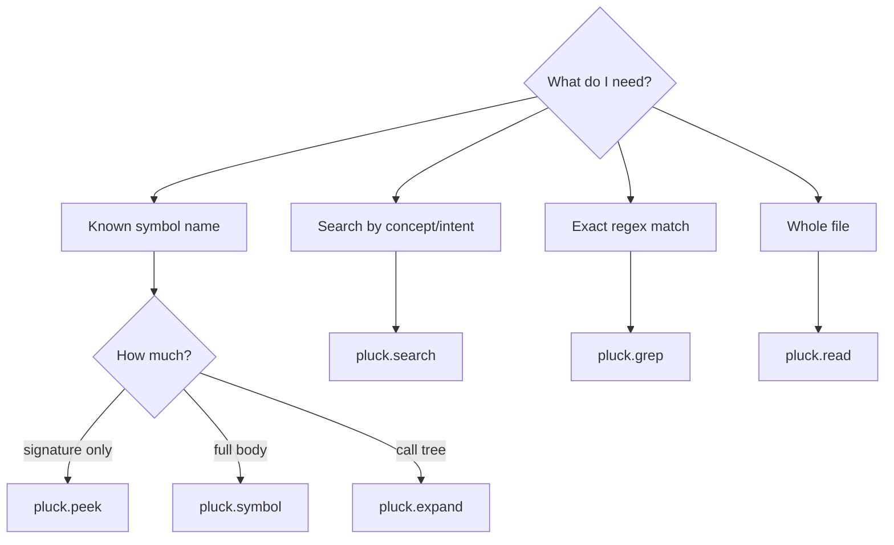
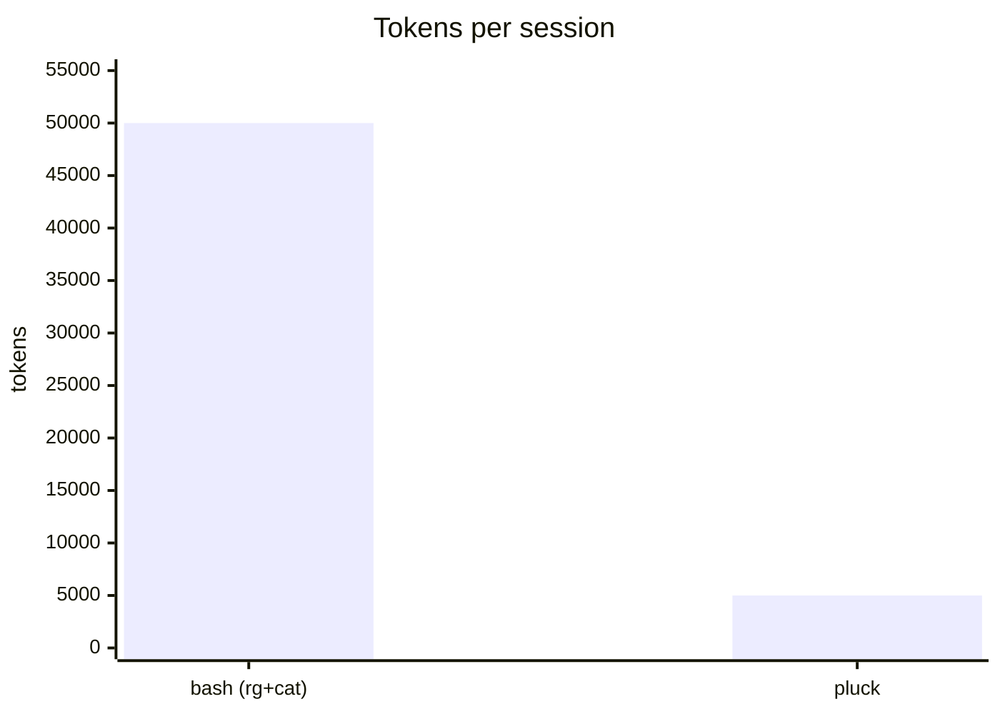
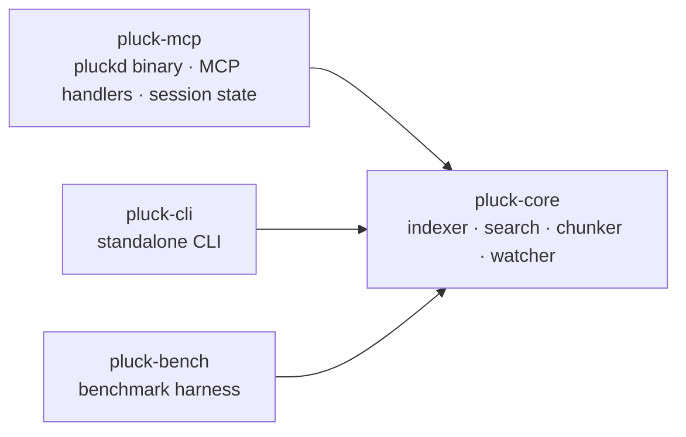

# pluck

> **AI 에이전트?** 이 파일은 사람을 위한 문서입니다 — 산문, 다이어그램, 시각 자료 포함.
> 에이전트용 파일은 [`AGENT.md`](AGENT.md): 툴 스펙, 노이즈 없음, 토큰 효율 최적화.

[](LICENSE)
[](https://www.rust-lang.org)
[](docs/BENCHMARKS.md)

**AI 코딩 에이전트를 위한 기본 검색(retrieval) 도구.**

`pluck`은 AI 에이전트가 코드를 읽고 검색할 때 `cat`과 `grep`을 대체하는 로컬 Rust 데몬입니다. MCP(Model Context Protocol)를 통해 심볼(Symbol) 인식 기반의 코드 읽기 및 검색 기능을 에이전트에게 제공하며, 서브 밀리초(sub-millisecond) 수준의 빠른 검색 속도와 ~85%의 토큰 절감 효과를 달성하면서도 에이전트의 역량 손실은 전혀 없습니다.

```
Before:  ls → grep → cat file1 → cat file2 → ...    (세션당 약 50,000 토큰)
After:   pluck.search / pluck.read(symbol)          (세션당 약 5,000 토큰, -90%)
```

## 왜 pluck을 써야 할까요?

AI 에이전트가 기존의 `cat`이나 `grep`을 사용해 코드베이스를 탐색하면 컨텍스트 윈도우의 토큰을 엄청나게 낭비하게 됩니다. 같은 파일 청크를 반복해서 읽거나, 상관없는 함수들까지 스크롤하고, 매번 똑같은 import 구문을 읽기 위해 토큰을 지불하다 보면 한 세션에만 수천 개의 토큰이 버려집니다.

pluck은 코드 검색을 위한 **에이전트 대면 계층(agent-facing layer)**을 제공하여 이 문제를 해결합니다. 핵심 원칙은 **에이전트가 수행하는 모든 검색 호출의 기본값이 pluck이 되어야 한다**는 것입니다. Bash는 pluck이 실질적으로 도움을 줄 수 없는 경우(예: 바이너리 파일, 레포지토리 외부 경로)에만 사용되는 폴백(fallback) 도구입니다.

- **스마트 아웃라인 (`pluck.read`)**: 1,000줄짜리 파일을 통째로 던져주는 대신, 시그니처만 포함된 토큰 효율적인 아웃라인을 반환합니다. 에이전트는 필요한 함수 본문만 골라서 가져올 수 있습니다.
- **세션 중복 제거 (Session Dedup)**: 에이전트가 "auth"를 검색하고 나중에 "token"을 검색했을 때 겹치는 코드 청크가 있다면, 1토큰짜리 플레이스홀더(`[already-shown: ...]`)로 대체합니다. 이미 에이전트의 컨텍스트에 있는 내용을 반복하는 것은 순전한 낭비이기 때문입니다.
- **기본적으로 무손실 (Lossless Default)**: 주석을 지우거나 타입을 제거하면 에이전트의 의사 결정 능력이 떨어집니다. pluck은 원본 바이트를 그대로 유지하며, 손실 모드는 명시적으로 선택할 때만 작동합니다.
- **100% 역량 보장**: 모든 pluck 도구에는 `cat`이나 `grep`과 바이트 단위로 정확히 동일하게 동작하는 `--raw` 폴백 옵션이 있습니다.

## 설치 방법

### 권장 방법 (0.1.0이 crates.io에 배포된 후)

```bash
# crates.io에서 데몬 + 독립 실행형 CLI 설치
cargo install pluck-mcp pluck-cli

# 또는 Homebrew tap을 통해 설치
brew tap hunhee98/pluck && brew install pluck
```

그런 다음 Claude Code 플러그인을 활성화합니다:

```text
/plugin marketplace add hunhee98/pluck
/plugin install pluck@hunhee98-pluck
```

### 소스에서 설치 (현재 사용 가능, 레지스트리 불필요)

```bash
git clone https://github.com/hunhee98/pluck
cd pluck
cargo install --path crates/pluck-mcp     # → pluckd
cargo install --path crates/pluck-cli     # → pluck
claude --plugin-dir $(pwd)/plugins/claude-code
```

## 작동 방식

pluck은 Tree-sitter를 사용해 AST(추상 구문 트리) 수준에서 파일을 청크로 나눕니다. 에이전트가 쿼리를 보내면, 키워드 매칭(BM25)과 시맨틱 유사도(ONNX 임베딩, potion-code-16M)를 혼합하여 이 청크들의 순위를 매깁니다. 즉, 에이전트가 정확한 변수 이름을 추측할 필요 없이 "결제 흐름(payment flow)" 같은 개념(concept)으로 검색할 수 있습니다.



<!-- image: architecture-overview.png -->

### 세션 중복 제거 예시



<!-- image: session-dedup-flow.png -->

## 6개의 MCP 도구

에이전트는 필요한 목적에 맞는 특정 도구를 호출합니다. Bash는 기본값이 아니라 폴백(fallback)입니다.



| 도구 (Wire name) | 대체 도구 | 사용 시점 |
|------------------|----------|----------|
| `mcp__pluck__read` | `cat` | 코드 파일 읽기 (기본적으로 스마트 아웃라인 제공; `raw: true` 시 바이트 단위로 정확히 일치) |
| `mcp__pluck__grep` | `grep` / `rg` | 키워드 검색 (모든 ripgrep 플래그 래핑됨) |
| `mcp__pluck__search` | — | 순위가 매겨진 청크 검색 (BM25 + 시맨틱 RRF) |
| `mcp__pluck__symbol` | `cat` + 스크롤 | 해당 함수/클래스만 읽기 |
| `mcp__pluck__peek` | — | 시그니처 및 직접 호출되는 요소만 확인 |
| `mcp__pluck__expand` | 다수의 `cat` | 심볼 및 최대 N 홉까지의 호출 체인 확인 |

## 독립 실행형 CLI (에이전트 없음)

터미널에서 직접 pluck을 사용할 수도 있습니다:

```bash
pluck index .
pluck search "auth flow" --repo .
pluck read src/auth/login.ts        # 스마트 아웃라인
pluck read src/auth/login.ts --raw  # cat과 바이트 단위로 동일
```

## 성능 및 토큰 절감 효과

재현 가능한 전체 수치는 [docs/BENCHMARKS.md](docs/BENCHMARKS.md)를 참조하세요.



| 시나리오 | 레포지토리 크기 | Bash 전용 | **pluck** |
|----------|-----------|-----------|-----------|
| 버그 수정 | 중간 (50k LOC) | 48k tok | **5k** |
| 리팩터링 | 큼 (500k LOC) | 112k 개 | **12k** |
| 탐색 | 모노레포 | 89k tok | **8k** |

<!-- image: token-savings-chart.png -->

### 기능 비교

| 기능 | `cat` + `grep` / `rg` | 다른 코드 검색 도구 | **pluck** |
|------------|----------------------|-------------------------|-----------|
| 하이브리드 BM25 + 시맨틱 랭킹 | ✗ | 대체로 ✓ | ✓ |
| AST 수준 청크 분할 | ✗ | 대체로 ✓ | ✓ |
| 영구 데몬 (MCP stdio) | — | ✗ (호출 시마다 콜드 CLI 실행) | **✓** |
| 영구 인덱스 (mmap) | — | 대체로 ✗ | **✓** |
| 증분 재색인 (파일 감시자) | — | 대체로 ✗ | **✓** |
| **세션 범위 내 중복 제거** | — | ✗ | **✓** |
| **`--raw` cat/grep 바이트 동등성** | — | ✗ | **✓** |
| **기본적으로 무손실, 옵션으로 손실 모드 제공** | — | 도구마다 다름 | **✓** |
| `peek` (시그니처 + 직접 호출 요소) | ✗ | ✗ | **✓** |
| 단일 파일 아웃라인 (`pluck.read`) | ✗ | ✗ | **✓** |
| 다중 홉 `expand` (호출 그래프) | ✗ | ✗ | **✓** |

## 아키텍처


