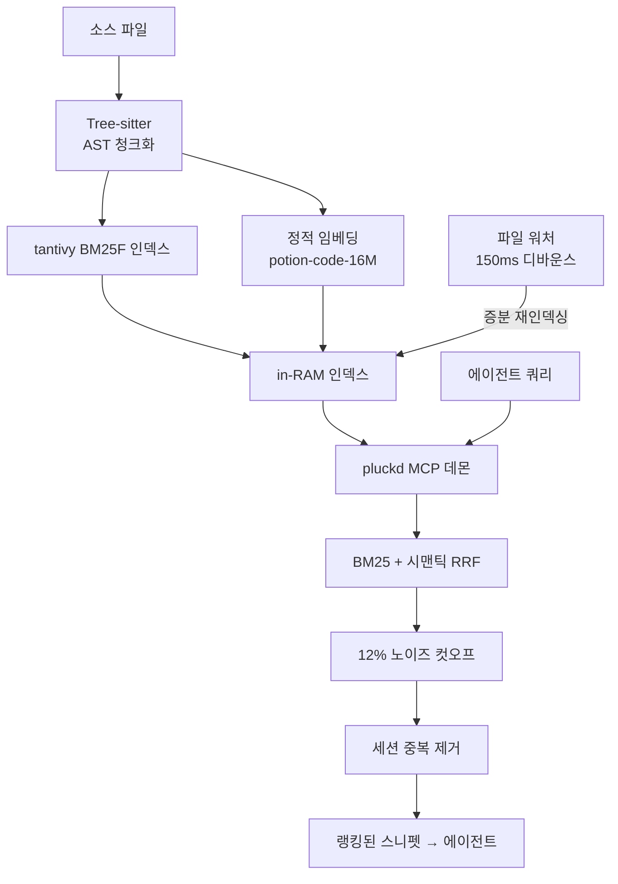
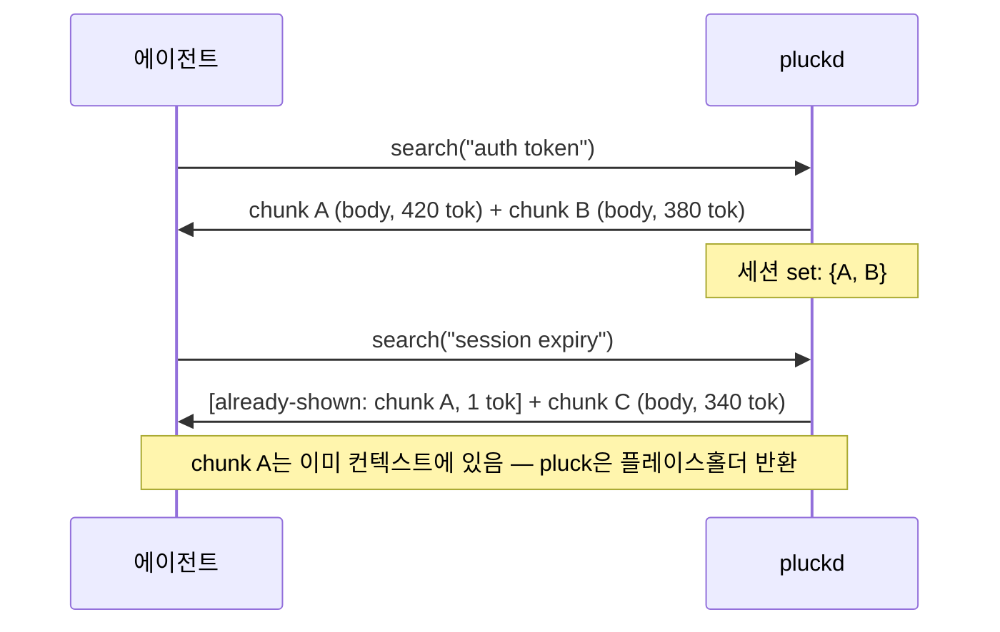
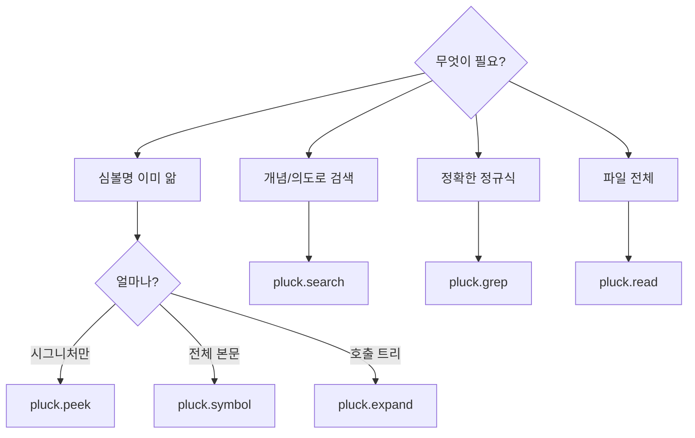
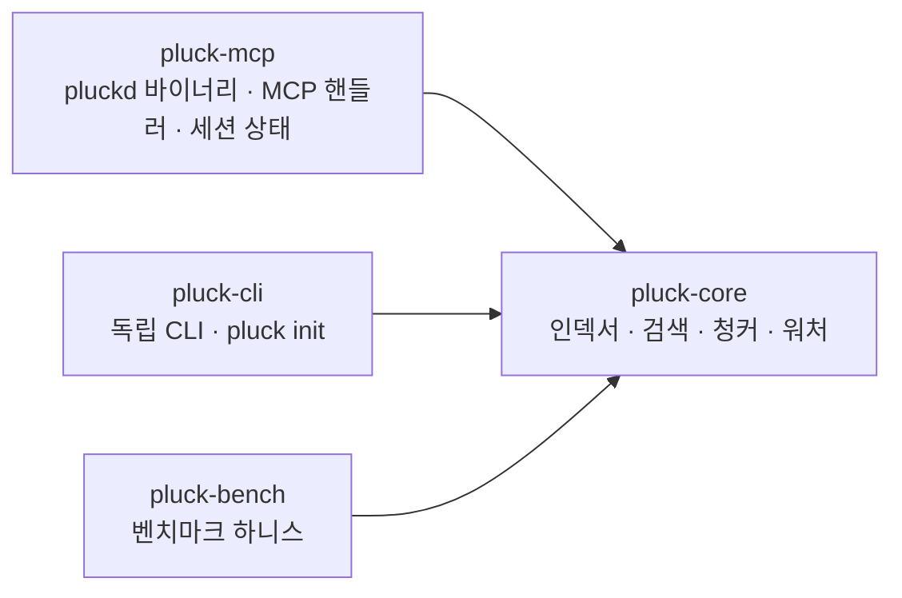

# pluck

> **AI 에이전트?** 이 파일은 사람을 위한 문서예요 — 산문, 다이어그램, 시각 자료가 포함되어 있어요.
> 에이전트용 파일은 [`AGENT.md`](AGENT.md)를 참고해 주세요: 툴 스펙, 노이즈 없음, 토큰 효율 최적화.

[](LICENSE)
[](https://www.rust-lang.org)
[](benchmarks/baseline.json)
[](benchmarks/baseline.json)

**AI 코딩 에이전트를 위한 MCP-네이티브 코드 검색기예요.**

`pluck`은 MCP(Model Context Protocol)를 통해 심볼 인식 기반의 코드 읽기 및 검색 기능을 에이전트에게 제공하는 로컬 Rust 데몬이에요. 장시간 진행되는 에이전트 세션에서 기본 검색 도구로 자리잡도록 설계되었어요. warm 검색 p50 0.06ms, 파일 변경부터 검색 가능까지 p50 183ms의 놀라운 속도를 자랑하며, 이미 보여준 청크는 1-토큰 플레이스홀더로 대체되어 에이전트가 같은 컨텍스트에 토큰을 중복 지불하지 않게 해준답니다.

## pluck이 잘하는 것과 아쉬운 것

**pluck이 강력한 영역:**

- **데몬 상주, 서브 밀리초 warm 검색:** 호출할 때마다 인덱스를 다시 만들지 않아요.
- **세션 중복 제거:** 한 MCP 세션 안에서 에이전트가 이미 본 청크는 `[already-shown: chunk_id]` (1 토큰)으로 치환돼요. 상태가 없는 CLI 도구는 구조적으로 따라올 수 없는 영역이죠.
- **파일 워처:** 파일 저장 후 검색 가능해지기까지 p50 183ms밖에 걸리지 않아요. 루프에 `index` 명령을 끼워 넣을 필요가 없답니다.
- **MCP-네이티브:** 6개 툴 모두 handshake 단계에서 `tools/list`로 설명을 노출해요. `CLAUDE.md`에 프롬프트 가이드를 수동으로 적지 않아도 에이전트가 적절한 툴을 스스로 골라요.

**pluck이 (아직) 아쉬운 영역:**

- **만능 CLI:** 다른 Rust 코드 검색 도구들은 `digest` 스타일의 빌드/CI 로그 압축, 파일 단위 의존/임팩트 그래프, 탐색 추천, 더 많은 언어 지원을 이미 제공해요. pluck은 아직 없지만, v0.2.0/v0.4.0에서 추가될 예정이에요 ([`docs/ROADMAP.md`](docs/ROADMAP.md) 참고).
- **이미 심볼명을 아는 경우의 grep 대체:** 리터럴 문자열 검색은 순수 `ripgrep`이 압도적으로 빨라요. `pluck.grep`은 ripgrep 패스스루라서 어느 쪽을 써도 무방해요.

핵심 가설은 **장시간 에이전트 세션 안에서는 inner loop가 누적된다**는 거예요. 한 번 쓰고 끝나는 one-shot 워크플로는 cold-start CLI로도 충분해요. pluck의 진짜 강점은 30번째 호출 이후부터 확실히 드러난답니다.

지금 당장 가장 넓은 one-shot CLI 표면이 필요하다면 이미 익숙한 broad-CLI 도구와 pluck을 함께 써도 좋아요. 상호 배타적이지 않으니까요.

## 설치하기

### 한 줄 설치 (0.1.0 crates.io 배포 후)

```bash
cargo install pluck-cli pluck-mcp
pluck init --target claude        # 현재 디렉토리의 .mcp.json에 등록
# 또는:
pluck init --target codex         # ~/.codex/config.toml에 등록
```

`pluck init`은 `which`로 `pluckd` 경로를 찾아 프로젝트(또는 Codex의 경우 전역)에 등록하며, 멱등성(idempotent)을 가지므로 바이너리 위치가 바뀌었을 때 언제든 다시 실행할 수 있어요.

### 소스 설치 (지금 바로 가능)

```bash
git clone https://github.com/hunhee98/pluck
cd pluck
cargo install --path crates/pluck-mcp     # → pluckd
cargo install --path crates/pluck-cli     # → pluck
pluck init --target claude
```

### 설치 검증

```bash
scripts/smoke.sh
```

여섯 가지 end-to-end 체크 (version + index + search + read + grep)로 설치가 완벽하게 되었는지 확인할 수 있어요.

## 작동 원리

pluck은 Tree-sitter를 사용해 파일을 AST 단위로 청크화해요. 에이전트가 쿼리를 보내면 BM25 (키워드)와 `model2vec` 스타일 정적 임베딩 ([`potion-code-16M`](https://huggingface.co/minishlab/potion-code-16M))을 RRF(reciprocal-rank fusion)로 결합해 청크의 순위를 매겨요. 런타임에 트랜스포머 추론은 없으며, 인코더는 룩업 행렬로 디스크에서 약 60MB 정도만 차지해요.



인덱스는 데몬이 시작될 때 다시 빌드돼요 (mmap 영구 디스크 인덱스는 SOON 로드맵에 있으며, v0.1.0에는 포함되지 않아요).

### 세션 중복 제거 동작



`session_dedup` 벤치 기준으로 세션 전체 토큰의 약 **40%를 절감(dedupe)**해요 ([`benchmarks/baseline.json`](benchmarks/baseline.json), `session_dedup_session_savings_pct` 참고).

## 6개의 MCP 툴

에이전트는 필요에 따라 특정 툴을 호출해요. Bash는 기본값이 아니라 최후의 수단(fallback)이랍니다.



| 툴 (와이어명) | 대체 대상 | 사용 시점 |
|---------------|-----------|-----------|
| `mcp__pluck__read` | `cat` | 코드 파일 읽기 (기본은 스마트 아웃라인; `raw: true`로 설정하면 바이트 단위로 정확히 읽어와요) |
| `mcp__pluck__grep` | `grep` / `rg` | 키워드 검색 (모든 ripgrep 플래그를 래핑했어요) |
| `mcp__pluck__search` | — | 랭킹된 청크 검색 (BM25 + 시맨틱 RRF) |
| `mcp__pluck__symbol` | `cat` + 스크롤 | 특정 함수/클래스만 쏙쏙 읽어오기 |
| `mcp__pluck__peek` | — | 시그니처 + 직접 호출되는 요소(callee)만 확인 |
| `mcp__pluck__expand` | 여러 번의 `cat` | 심볼 + N홉까지의 호출 체인(callee) 확인 |

모든 툴에는 `raw` 모드 fallback이 있어서 `cat`이나 `grep`과 바이트 단위로 동일하게 동작해요. 즉, pluck을 기본으로 써도 에이전트의 역량 손실은 전혀 없답니다.

## 독립 실행 CLI (에이전트 없이)

터미널에서 직접 pluck을 사용할 수도 있어요:

```bash
pluck index .
pluck search "auth flow" --repo .
pluck read src/auth/login.ts        # 스마트 아웃라인
pluck read src/auth/login.ts --raw  # 바이트 단위 cat과 동일
pluck grep "TODO"                   # ripgrep 패스스루
```

## 측정치

페이지에 나오는 모든 숫자는 고정된 베이스라인(frozen baseline) 행이거나 측정된 시나리오에 기반해요. 예측이나 희망 사항이 섞인 수치는 없답니다.

| 지표 | 값 | 출처 |
|------|----|------|
| Chunker p50 (medium repo) | 4.24 ms | `benchmarks/baseline.json` → `chunker_medium_ms_p50` |
| Indexer 처리량 (medium) | 386 files/s | `benchmarks/baseline.json` → `indexer_files_per_sec_medium` |
| Warm 검색 p50 (medium) | 0.06 ms | `benchmarks/baseline.json` → `warm_search_p50_ms_medium` |
| 파일 저장 → 검색 가능 p50 | 183 ms | `benchmarks/baseline.json` → `freshness_p50_ms_medium` |
| 세션 중복 제거 절감 | 40 % | `benchmarks/baseline.json` → `session_dedup_session_savings_pct` |
| 단일 시나리오 토큰 감소 (`fix/auth-token-expiry`, bash vs pluck) | 1248 → 931 tok (-25 %) | [`benchmarks/results/fix-auth-token-expiry-…json`](benchmarks/results/fix-auth-token-expiry-1778750775.json) |

`fix` / `refactor` / `explore` / `search` / `review` 시나리오 전반에 걸친 LLM-in-the-loop 측정은 v0.5.0 로드맵 (`real LLM-in-loop bench`)에 있어요. 수치는 측정된 후에만 공개하며, 미리 지어내지 않아요.

## 기능(Capability) 비교

순수 `cat` + `grep` / `rg` 대비 pluck이 추가로 제공하는 기능이에요:

| 기능 | `cat` + `grep` / `rg` | **pluck** |
|------------|------------------------|-----------|
| AST 단위 청크 | ✗ | ✓ |
| Hybrid BM25 + 시맨틱 랭킹 | ✗ | ✓ |
| 데몬 상주 (MCP stdio) | ✗ | ✓ |
| 증분 재인덱싱 (파일 워처) | ✗ | ✓ |
| 세션 단위 중복 제거 | ✗ | ✓ |
| `--raw` cat/grep 바이트 동등 | — | ✓ |
| 무손실 기본, 손실 모드 opt-in | — | ✓ |
| `peek` (시그니처 + 직접 callee) | ✗ | ✓ |
| 단일 파일 아웃라인 | ✗ | ✓ |
| 멀티 홉 `expand` (콜 그래프) | ✗ | ✓ |

비슷한 hybrid-search CLI 도구와의 정직한 비교예요:

| 기능 | 다른 Rust 코드 검색 CLI | **pluck** |
|------------|-----------------|-----------|
| Hybrid BM25 + 시맨틱 랭킹 | ✓ | ✓ |
| Tree-sitter AST 청크화 | ✓ | ✓ |
| 빌드/CI 로그 압축 (`digest`) | ✓ | ✗ — v0.2.0 |
| 파일 단위 의존 그래프 (`deps`/`impact`) | ✓ | 부분적 (`expand`가 심볼 단위 callee) |
| 탐색 추천 (`plan`) | ✓ | ✗ — v0.2.0 |
| 언어 커버리지 | 11 | 5 (Rust / Py / TS / Go / JS) — v0.4.0에 12로 확대 |
| MCP-네이티브 (handshake 툴 설명) | ✗ (CLAUDE.md 프롬프트만) | ✓ |
| 데몬 상주 warm 검색 | ✗ (호출마다 인덱스 재빌드) | ✓ — 0.06 ms p50 |
| 세션 단위 중복 제거 | ✗ | ✓ — 벤치 기준 40% 절감 |
| 워처 / 증분 | ✗ | ✓ — 183 ms p50 |
| 단일 바이너리 설치 | ✓ | ✓ — `cargo install` + `pluck init` |

객관적으로 보면, 비슷한 도구들이 현재 더 넓은 one-shot CLI 표면 (digest, deps/impact, plan, 언어)을 가지고 있고, pluck은 더 깊은 inner-loop 아키텍처 (MCP-네이티브, 데몬 상주, 워처, 세션 인식)를 가지고 있어요. 로드맵은 v0.1.0에서 단순히 기능 갯수를 맞추는 게 아니라, **아키텍처 우위를 바탕으로** 부족한 부분을 채워가는 순서로 진행돼요.

## 아키텍처



`pluck-core` 크레이트는 설계상 MCP에 의존하지 않아요. 덕분에 나중에 Aider / OpenHands / Cursor 하니스를 플러그인처럼 쉽게 추가할 수 있답니다 (v0.5.0, [`docs/ROADMAP.md`](docs/ROADMAP.md) 참고).

## 로드맵

[`docs/ROADMAP.md`](docs/ROADMAP.md)에는 향후 1년의 계획이 버전별로 나뉘어 있어요 (v0.1.0 배포 기준선 → v0.5.0 채택 및 가시성 확보). 요약하면 다음과 같아요:

- **v0.1.0** (next): 첫 crates.io 배포, 3가지 안전장치(safety guard), `pluck init`, 오픈소스 위생 관리. 기능 범위는 좁고 새 툴은 없어요.
- **v0.2.0**: `pluck.digest`, `pluck.impact`, `pluck.deps`, `pluck.plan` — CLI 기능의 부족한 점을 채워요.
- **v0.3.0**: 자연어(NL) 리콜 품질 향상 — cascade, query expansion, 100-쿼리 라벨 세트, NDCG@10.
- **v0.4.0**: Java / C / C++ / Kotlin / Ruby / PHP / Swift 청커 추가.
- **v0.5.0**: 채택률 카운터, A/B description 하니스, LLM-in-loop 벤치마크, 멀티 에이전트 하니스.

## 라이선스

MIT — 자세한 내용은 [LICENSE](LICENSE)를 참고하세요.

## English readme

[`README.md`](README.md)에서 영문 버전을 확인할 수 있어요.
