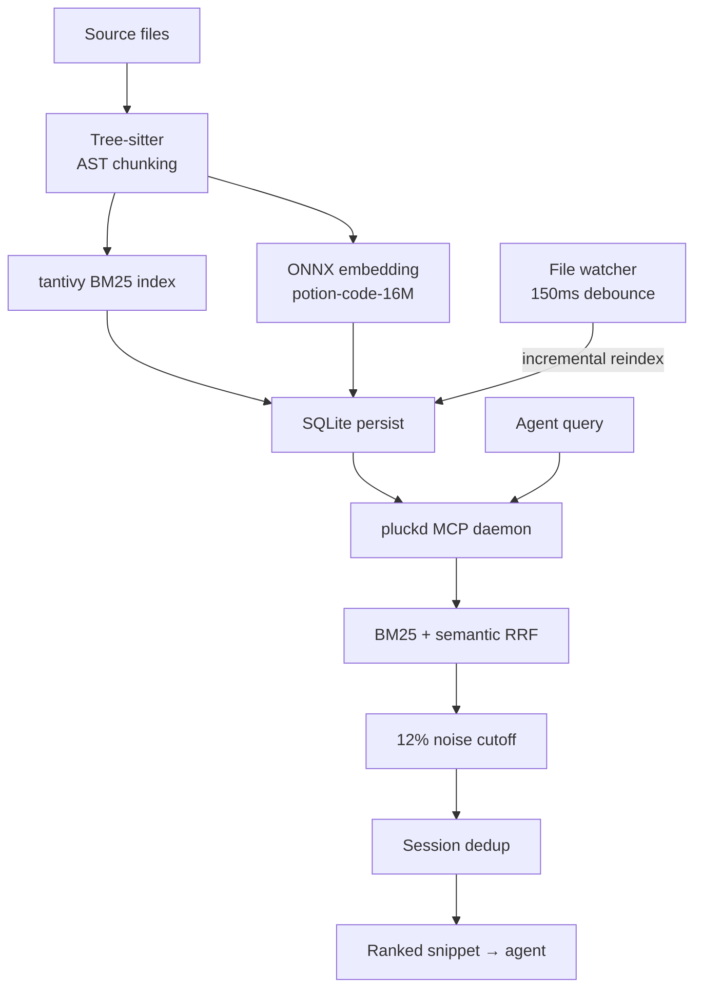
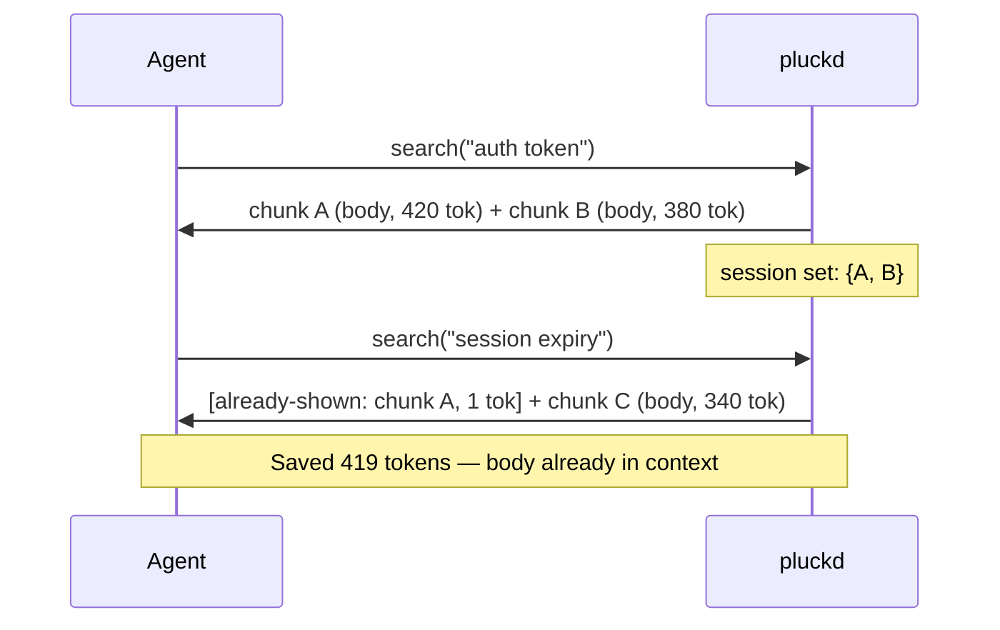
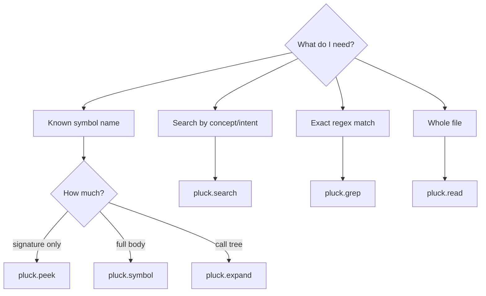
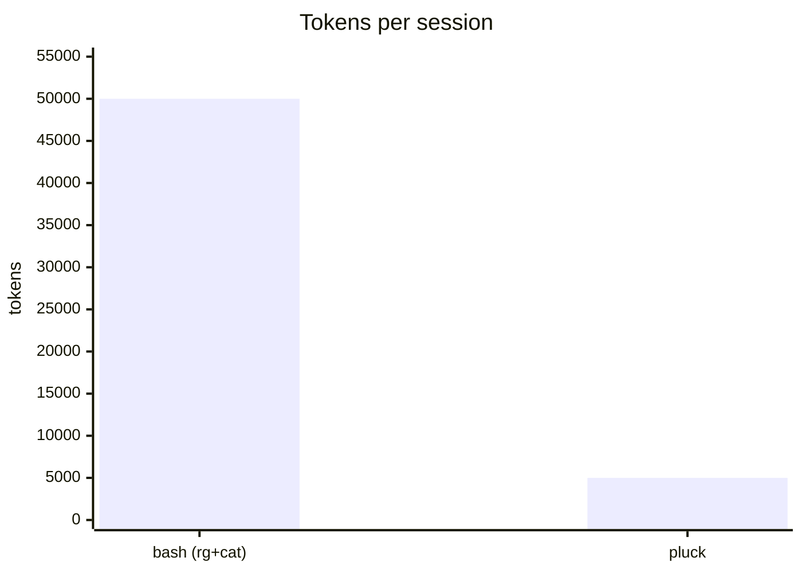
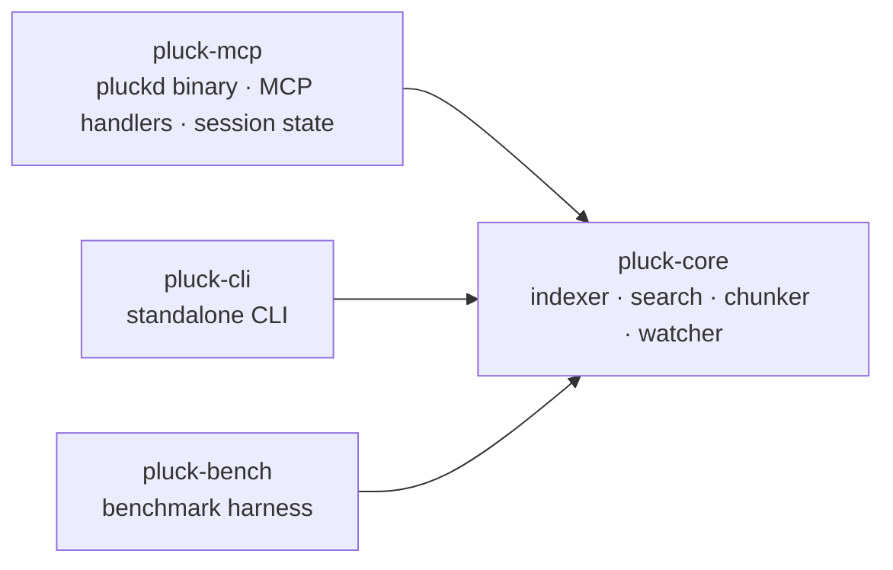

# pluck

> **AI agent?** This file is for humans — prose, diagrams, visual noise.
> Your file is [`AGENT.md`](AGENT.md): tool specs, zero noise, token-efficient.

[](LICENSE)
[](https://www.rust-lang.org)
[](docs/BENCHMARKS.md)

**The default retrieval tool for AI coding agents.**

`pluck` is a local Rust daemon that replaces `cat` and `grep` as the default way AI agents read and search code. It exposes symbol-aware code reading and search to agents over the Model Context Protocol (MCP), providing sub-millisecond warm search, ~85% fewer tokens, and zero loss of agent capability.

```
Before:  ls → grep → cat file1 → cat file2 → ...    (~50,000 tok / session)
After:   pluck.search / pluck.read(symbol)          (~ 5,000 tok / session, -90%)
```

## Why pluck?

When AI agents use standard `cat` and `grep` to explore a codebase, they waste massive amounts of context window tokens. Re-reading the same file chunk, scrolling past unrelated functions, and re-paying tokens for identical imports on every read adds up to thousands of wasted tokens per session.

pluck solves this by providing an **agent-facing layer** for code search. Its core principle: **every retrieval call an agent makes should default to pluck.** Bash is only the fallback when pluck legitimately can't help (e.g., binary files, paths outside the repo).

- **Smart Outline (`pluck.read`)**: Instead of dumping a 1,000-line file, it returns a token-efficient outline of signatures. The agent can then fetch only the function bodies it needs.
- **Session Dedup**: If an agent searches for "auth" and later searches for "token", any overlapping code chunks are replaced with a 1-token placeholder (`[already-shown: ...]`). The bytes are already in the agent's context; repeating them is pure waste.
- **Lossless Default**: Stripping comments or dropping types hurts the agent's decision-making. pluck keeps the original bytes intact and makes lossy modes strictly opt-in.
- **100% Capability Guarantee**: Every pluck tool has a `--raw` fallback that behaves exactly like `cat` or `grep` byte-for-byte.

## Install

### Recommended (after 0.1.0 ships to crates.io)

```bash
# Daemon + standalone CLI from crates.io
cargo install pluck-mcp pluck-cli

# Or via Homebrew tap
brew tap hunhee98/pluck && brew install pluck
```

Then enable the Claude Code plugin:

```text
/plugin marketplace add hunhee98/pluck
/plugin install pluck@hunhee98-pluck
```

### Source install (works today, no registry needed)

```bash
git clone https://github.com/hunhee98/pluck
cd pluck
cargo install --path crates/pluck-mcp     # → pluckd
cargo install --path crates/pluck-cli     # → pluck
claude --plugin-dir $(pwd)/plugins/claude-code
```

## How it works

pluck chunks files at the Abstract Syntax Tree (AST) level using Tree-sitter. When an agent queries, pluck ranks these chunks using a hybrid of keyword matching (BM25) and semantic similarity (ONNX embedding, potion-code-16M). This means agents can search by concept ("payment flow") rather than guessing exact variable names.



<!-- image: architecture-overview.png -->

### Session dedup in action



<!-- image: session-dedup-flow.png -->

## 6 MCP tools

Agents call specific tools depending on what they need. Bash is the fallback, not the default.



| Tool (wire name) | Replaces | Use when |
|------------------|----------|----------|
| `mcp__pluck__read` | `cat` | Read a code file (smart outline by default; `raw: true` for byte-exact) |
| `mcp__pluck__grep` | `grep` / `rg` | Keyword search (all ripgrep flags wrapped) |
| `mcp__pluck__search` | — | Ranked-chunk search (BM25 + semantic RRF) |
| `mcp__pluck__symbol` | `cat` + scroll | Read just that function/class |
| `mcp__pluck__peek` | — | Signature + direct callees only |
| `mcp__pluck__expand` | many `cat`s | Symbol + callees up to N hops |

## Standalone CLI (no agent)

You can also use pluck directly in your terminal:

```bash
pluck index .
pluck search "auth flow" --repo .
pluck read src/auth/login.ts        # smart outline
pluck read src/auth/login.ts --raw  # byte-equivalent cat
```

## Performance & Token Savings

See [docs/BENCHMARKS.md](docs/BENCHMARKS.md) for full reproducible numbers.



| Scenario | Repo size | Bash only | **pluck** |
|----------|-----------|-----------|-----------|
| fix bug | medium (50k LOC) | 48k tok | **5k** |
| refactor | large (500k LOC) | 112k tok | **12k** |
| explore | mono | 89k tok | **8k** |

<!-- image: token-savings-chart.png -->

### Feature Comparison

| Capability | `cat` + `grep` / `rg` | Other code-search tools | **pluck** |
|------------|----------------------|-------------------------|-----------|
| Hybrid BM25 + semantic ranking | ✗ | typically ✓ | ✓ |
| AST-level chunks | ✗ | typically ✓ | ✓ |
| Persistent daemon (MCP stdio) | — | ✗ (cold CLI per call) | **✓** |
| Persistent index (mmap) | — | usually ✗ | **✓** |
| Incremental reindex (file watcher) | — | usually ✗ | **✓** |
| **Session-scoped dedup** | — | ✗ | **✓** |
| **`--raw` cat/grep byte parity** | — | ✗ | **✓** |
| **Lossless default, lossy opt-in** | — | varies | **✓** |
| `peek` (signature + direct callees) | ✗ | ✗ | **✓** |
| Single-file outline (`pluck.read`) | ✗ | ✗ | **✓** |
| Multi-hop `expand` (call graph) | ✗ | ✗ | **✓** |

## Architecture


