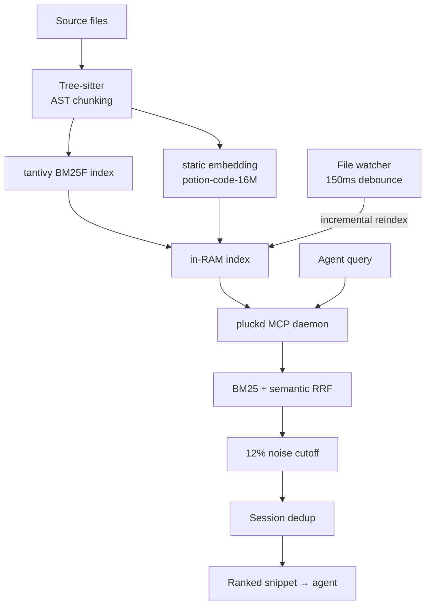
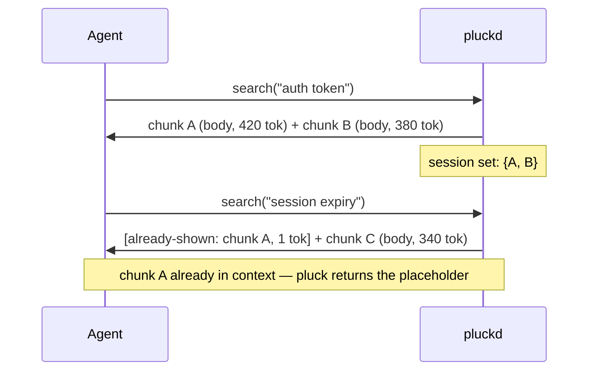
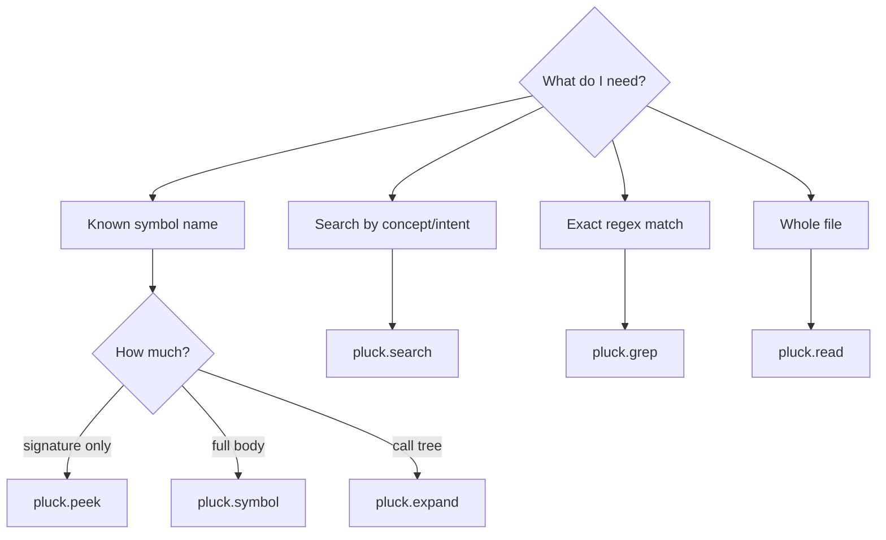
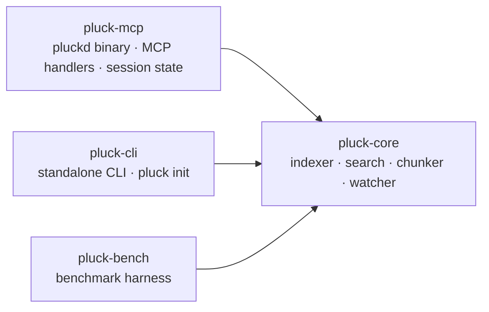

# pluck

> **AI agent?** This file is for humans — prose, diagrams, visual noise.
> Your file is [`AGENT.md`](AGENT.md): tool specs, zero noise, token-efficient.

[](LICENSE)
[](https://www.rust-lang.org)
[](benchmarks/baseline.json)
[](benchmarks/baseline.json)

**MCP-native code retrieval for AI coding agents.**

`pluck` is a local Rust daemon that exposes symbol-aware code reading and search to agents over the Model Context Protocol (MCP). It's designed to be the default retrieval surface inside long agent sessions: warm search runs in 0.06 ms p50, file changes become searchable in 183 ms p50, and re-shown chunks collapse to a 1-token placeholder so the agent doesn't re-pay for context it already has.

## Why pluck — and where it isn't the best fit

**What pluck is sharp at:**

- **Daemon-resident, sub-millisecond warm search.** No re-index cost per call.
- **Session dedup.** Within an MCP session, chunks the agent has already seen are replaced with `[already-shown: chunk_id]` (1 token). Comparable CLI tools have no equivalent because they're stateless.
- **File watcher.** Save a file → 183 ms p50 until the change is searchable. No `index` command in the loop.
- **MCP-native.** Six tools with full `tools/list` descriptions at handshake, so the agent picks the right tool without prompt-engineering hints in your `CLAUDE.md`.

**What pluck is not (yet):**

- **A Swiss-army CLI.** Other Rust code-retrieval tools today ship `digest`-style build/CI log compression, file-level dependency / impact graphs, exploration recommenders, and broader language coverage. pluck doesn't yet — those land in v0.2.0 and v0.4.0 (see the version arc at the bottom of this README).
- **A grep replacement when you already know the symbol.** Plain `ripgrep` is unbeatably fast at literal-string search; `pluck.grep` is a ripgrep passthrough, so use either.

The architectural bet is that **the inner loop compounds over the course of a long agent session**. Cold-start CLI is fine for one-shot queries; pluck's edges show up after the 30th call.

If you want the widest one-shot CLI surface today, run pluck alongside whichever broad-CLI tool already fits your shell workflow — they're not mutually exclusive.

## Install

### One-command (after 0.1.0 ships to crates.io)

```bash
cargo install pluck-cli pluck-mcp
pluck init --target claude        # writes .mcp.json in $PWD
# or:
pluck init --target codex         # writes ~/.codex/config.toml
```

`pluck init` resolves the `pluckd` binary via `which`, registers it under the project (or global, for Codex), and is idempotent — re-run it any time the binary moves.

### Source install (works today)

```bash
git clone https://github.com/hunhee98/pluck
cd pluck
cargo install --path crates/pluck-mcp     # → pluckd
cargo install --path crates/pluck-cli     # → pluck
pluck init --target claude
```

### Verify

```bash
scripts/smoke.sh
```

Six end-to-end checks (version + index + search + read + grep) prove the install isn't half-broken.

## How it works

pluck chunks files at the AST level using Tree-sitter. When an agent queries, pluck ranks chunks with a hybrid of BM25 (keyword) and a static `model2vec`-style embedding ([`potion-code-16M`](https://huggingface.co/minishlab/potion-code-16M)) fused via reciprocal-rank fusion. No transformer inference at runtime — the encoder is a lookup matrix, ~60 MB on disk.



The index is rebuilt on daemon start (mmap-persistent on-disk index is roadmapped as SOON, not v0.1.0).

### Session dedup in action



Over the `session_dedup` bench, this dedupes about **40 % of total session tokens** (see [`benchmarks/baseline.json`](benchmarks/baseline.json), `session_dedup_session_savings_pct`).

## 6 MCP tools

Agents call specific tools depending on what they need. Bash is the fallback, not the default.



| Tool (wire name) | Replaces | Use when |
|------------------|----------|----------|
| `mcp__pluck__read` | `cat` | Read a code file (smart outline by default; `raw: true` for byte-exact) |
| `mcp__pluck__grep` | `grep` / `rg` | Keyword search (every ripgrep flag wrapped) |
| `mcp__pluck__search` | — | Ranked-chunk search (BM25 + semantic RRF) |
| `mcp__pluck__symbol` | `cat` + scroll | Read just that function/class |
| `mcp__pluck__peek` | — | Signature + direct callees only |
| `mcp__pluck__expand` | many `cat`s | Symbol + callees up to N hops |

Every tool has a `raw`-mode fallback that matches `cat` / `grep` byte-for-byte, so the agent never loses capability by defaulting to pluck.

## Standalone CLI (no agent)

```bash
pluck index .
pluck search "auth flow" --repo .
pluck read src/auth/login.ts        # smart outline
pluck read src/auth/login.ts --raw  # byte-equivalent cat
pluck grep "TODO"                   # ripgrep passthrough
```

## Numbers

Every number on this page cites a frozen baseline row or a measured scenario. No projected / aspirational percentages.

| Metric | Value | Source |
|--------|-------|--------|
| Chunker p50 (medium repo) | 4.24 ms | `benchmarks/baseline.json` → `chunker_medium_ms_p50` |
| Indexer throughput (medium) | 386 files/s | `benchmarks/baseline.json` → `indexer_files_per_sec_medium` |
| Warm search p50 (medium) | 0.06 ms | `benchmarks/baseline.json` → `warm_search_p50_ms_medium` |
| File save → searchable p50 | 183 ms | `benchmarks/baseline.json` → `freshness_p50_ms_medium` |
| Session dedup savings | 40 % | `benchmarks/baseline.json` → `session_dedup_session_savings_pct` |
| Single-scenario token reduction (`fix/auth-token-expiry`, bash vs pluck) | 1248 → 931 tok (-25 %) | [`benchmarks/results/fix-auth-token-expiry-…json`](benchmarks/results/fix-auth-token-expiry-1778750775.json) |

Broader LLM-in-the-loop measurements across `fix` / `refactor` / `explore` / `search` / `review` scenarios are on the roadmap as v0.5.0 work (`real LLM-in-loop bench`). We'll publish those numbers when they exist, not before.

## Capability comparison

vs raw `cat` + `grep` / `rg` — what pluck adds:

| Capability | `cat` + `grep` / `rg` | **pluck** |
|------------|------------------------|-----------|
| AST-level chunks | ✗ | ✓ |
| Hybrid BM25 + semantic ranking | ✗ | ✓ |
| Persistent daemon (MCP stdio) | ✗ | ✓ |
| Incremental reindex (file watcher) | ✗ | ✓ |
| Session-scoped dedup | ✗ | ✓ |
| `--raw` cat/grep byte parity | — | ✓ |
| Lossless default, lossy opt-in | — | ✓ |
| `peek` (signature + direct callees) | ✗ | ✓ |
| Single-file outline | ✗ | ✓ |
| Multi-hop `expand` (call graph) | ✗ | ✓ |

vs comparable hybrid-search CLI tools — honest split:

| Capability | Other Rust code-retrieval CLIs | **pluck** |
|------------|--------------------------|-----------|
| Hybrid BM25 + semantic ranking | ✓ | ✓ |
| Tree-sitter AST chunking | ✓ | ✓ |
| Build / CI log compression (`digest`) | ✓ | ✗ — v0.2.0 |
| File-level dependency graph (`deps`/`impact`) | ✓ | partial (`expand` does symbol-level callees) |
| Exploration recommender (`plan`) | ✓ | ✗ — v0.2.0 |
| Language coverage | 11 | 5 (Rust / Py / TS / Go / JS) — v0.4.0 fills to 12 |
| MCP-native (tool descriptions at handshake) | ✗ (CLAUDE.md prompt only) | ✓ |
| Daemon-resident warm search | ✗ (index rebuilt per call) | ✓ — 0.06 ms p50 |
| Session-scoped dedup | ✗ | ✓ — 40 % savings on the bench |
| Watcher / incremental | ✗ | ✓ — 183 ms p50 |
| Single-binary install | ✓ | ✓ — `cargo install` + `pluck init` |

Read this honestly: comparable tools currently have a wider one-shot CLI surface (digest, deps/impact, plan, more languages). pluck currently has the deeper inner-loop architecture (MCP-native, daemon-resident, watcher-driven, session-aware). The roadmap closes the surface gap from a position of architectural strength rather than racing on parity at v0.1.0.

## Architecture



The `pluck-core` crate has no MCP dependency by design — that's what keeps Aider / OpenHands / Cursor harnesses pluggable later (v0.5.0 work, below).

## Roadmap

The next year, cut into per-version sections (v0.1.0 ship cutline → v0.5.0 adoption + observability):

- **v0.1.0** (next): first crates.io publish, three safety guards, `pluck init`, OSS hygiene. Sharp surface, no new tools.
- **v0.2.0**: `pluck.digest`, `pluck.impact`, `pluck.deps`, `pluck.plan` — close the CLI-surface gap.
- **v0.3.0**: NL recall quality — cascade, query expansion, 100-query labeled set, NDCG@10.
- **v0.4.0**: Java / C / C++ / Kotlin / Ruby / PHP / Swift chunkers.
- **v0.5.0**: adoption-rate counter, A/B description harness, LLM-in-loop bench, multi-agent harnesses.

## License

MIT — see [LICENSE](LICENSE).

## Korean readme

[`README.ko.md`](README.ko.md).
