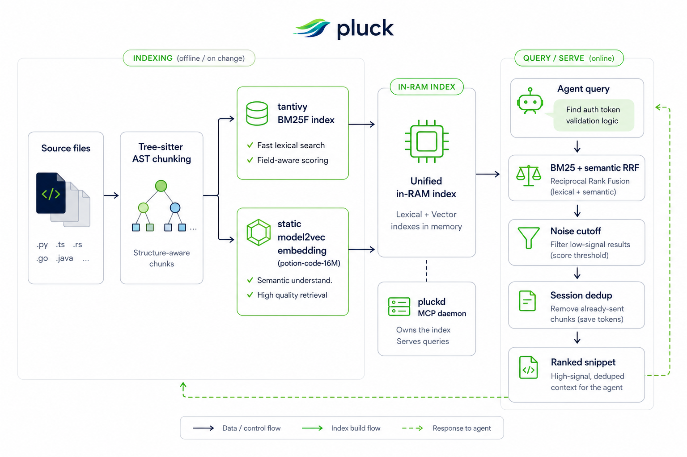
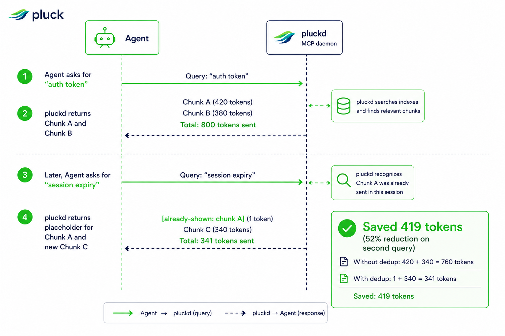
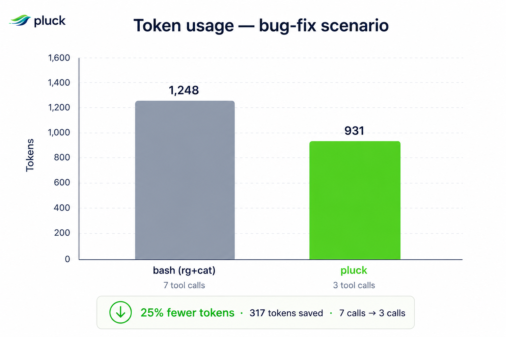

<h2 align="center">
  <!-- GPT IMAGE PROMPT: A sleek, modern logo for 'pluck', an AI code search tool. The logo should feature a stylized bird or feather motif, or a fast-moving abstract shape, with a clean tech-focused aesthetic. Use vibrant green and dark blue tones. Transparent background. -->
  <br/>
  The MCP-native Code Retrieval Engine for AI Agents<br/>
  <sub>0.07 ms warm search · 171 ms save → searchable · 71 % CI-log compression — every number gated by <a href="benchmarks/baseline.json"><code>benchmarks/baseline.json</code></a></sub>
</h2>

<div align="center">
  <h2>
    <a href="https://crates.io/crates/pluck-mcp"></a>
    <a href="https://github.com/hunhee98/pluck/blob/main/LICENSE">
      
    </a>
    <a href="https://www.rust-lang.org"></a>
  </h2>

[Quickstart](#quickstart) •
[Why Pluck?](#why-pluck) •
[MCP Tools](#mcp-tools) •
[CLI](#standalone-cli-no-agent) •
[Benchmarks](#performance--token-savings)

</div>

**pluck** is a local Rust daemon that replaces `cat` and `grep` as the default way AI agents read and search code. It exposes symbol-aware code reading and search to agents over the Model Context Protocol (MCP). Sub-millisecond warm search, AST-level chunking, and session-aware deduplication — with a `--raw` fallback on every tool so the agent never loses capability by defaulting to pluck.

```
Without pluck:  ls → grep → cat file1 → cat file2 → cat file3 → ...
With pluck:     pluck.plan "fix auth-token expiry"  → 3-5 next-call recommendations
                pluck.search "auth flow"            → ranked chunks, BM25 + semantic
                pluck.peek validate_token           → signature + callees only
                pluck.symbol validate_token         → just that function's body
                pluck.impact validate_token         → every caller, depth-capped
                pluck.deps src/auth/login.ts        → forward/reverse import graph
                pluck.digest < cargo-build.log      → 71 % shorter, errors intact
```

## Quickstart

Pluck is designed to be the default retrieval tool for your AI coding agents.

### 1. Install Pluck

```bash
# Daemon + standalone CLI from crates.io
cargo install pluck-mcp pluck-cli

# Or via Homebrew tap
brew tap hunhee98/pluck && brew install pluck
```

### 2. Add to your Agent

**Claude Code**
```bash
pluck init --target claude
```
*(Alternatively, you can manually enable it via `/plugin marketplace add hunhee98/pluck`)*

**Codex**
```bash
pluck init --target codex
```

## Why pluck?

When AI agents use standard `cat` and `grep` to explore a codebase, they waste massive amounts of context window tokens. Re-reading the same file chunk, scrolling past unrelated functions, and re-paying tokens for identical imports on every read adds up to thousands of wasted tokens per session.

pluck solves this by providing an **agent-facing layer** for code search. Its core principle: **every retrieval call an agent makes should default to pluck.** Bash is only the fallback when pluck legitimately can't help (e.g., binary files, paths outside the repo).

- **Smart Outline (`pluck.read`)**: Instead of dumping a 1,000-line file, it returns a token-efficient outline of signatures. The agent can then fetch only the function bodies it needs.
- **Session Dedup**: If an agent searches for "auth" and later searches for "token", any overlapping code chunks are replaced with a 1-token placeholder (`[already-shown: ...]`). The bytes are already in the agent's context; repeating them is pure waste.
- **Lossless Default**: Stripping comments or dropping types hurts the agent's decision-making. pluck keeps the original bytes intact and makes lossy modes strictly opt-in.
- **100% Capability Guarantee**: Every pluck tool has a `--raw` fallback that behaves exactly like `cat` or `grep` byte-for-byte.

## How it works

pluck chunks files at the Abstract Syntax Tree (AST) level using Tree-sitter. When an agent queries, pluck ranks these chunks using a hybrid of keyword matching (BM25F over symbol/signature/content) and semantic similarity (a static `model2vec`-style lookup, [`potion-code-16M`](https://huggingface.co/minishlab/potion-code-16M), ~60 MB on disk — no transformer inference at runtime). The two rankings fuse via reciprocal-rank fusion. This means agents can search by concept ("payment flow") rather than guessing exact variable names.

<!-- GPT IMAGE PROMPT: A clean, modern architectural diagram showing how 'pluck' works. It should show 'Source files' going into 'Tree-sitter AST chunking', splitting into 'tantivy BM25F index' and 'static model2vec embedding (potion-code-16M)'. These feed into an 'in-RAM index' managed by 'pluckd MCP daemon'. An 'Agent query' comes in, goes through 'BM25 + semantic RRF', 'Noise cutoff', 'Session dedup', and finally returns a 'Ranked snippet'. Use a dark theme with neon green and blue accents. -->
<p align="center">
  
</p>

### Session dedup in action

<!-- GPT IMAGE PROMPT: A sequence diagram illustrating 'Session dedup'. An 'Agent' asks 'pluckd' for "auth token". pluckd returns Chunk A (420 tokens) and Chunk B (380 tokens). Later, the Agent asks for "session expiry". pluckd realizes Chunk A was already sent, so it returns a 1-token placeholder [already-shown: chunk A] along with a new Chunk C (340 tokens). The diagram should visually highlight the "Saved 419 tokens" aspect. -->
<p align="center">
  
</p>

## MCP Tools

Agents call specific tools depending on what they need. Bash is the fallback, not the default.

| Tool (wire name) | Replaces | Use when |
|------------------|----------|----------|
| `mcp__pluck__read` | `cat` | Read a code file (smart outline by default; `raw: true` for byte-exact) |
| `mcp__pluck__grep` | `grep` / `rg` | Keyword search (all ripgrep flags wrapped) |
| `mcp__pluck__search` | — | Ranked-chunk search (BM25 + semantic RRF) |
| `mcp__pluck__symbol` | `cat` + scroll | Read just that function/class |
| `mcp__pluck__peek` | — | Signature + direct callees only |
| `mcp__pluck__expand` | many `cat`s | Symbol + callees up to N hops |
| `mcp__pluck__impact` | grep + read each caller | Reverse call graph — "who calls this symbol?" |
| `mcp__pluck__deps` | grep imports + read each file | File-level import graph — "what does this file depend on / who imports it?" |
| `mcp__pluck__digest` | piping `cargo build`/`pytest`/CI logs to `cat` | Compress verbose tool output (errors / panics kept verbatim, progress lines collapsed) |
| `mcp__pluck__plan` | speculative `search`/`read` loop | Given a free-form task, recommend the next 3-5 retrieval calls + confidence indicator |

## Standalone CLI (no agent)

You can also use pluck directly in your terminal:

```bash
pluck index .
pluck search "auth flow" --repo .
pluck read src/auth/login.ts        # smart outline
pluck read src/auth/login.ts --raw  # byte-equivalent cat
```

## Performance & Token Savings

Every number on this page cites a frozen baseline row or a measured scenario. No projected / aspirational percentages.

<!-- GPT IMAGE PROMPT: A bar chart comparing token usage per session between "bash (rg+cat)" and "pluck". The "bash" bar should be high and colored red or gray. The "pluck" bar should be lower and colored bright green. The title should be "Tokens per session". Clean, modern UI style. -->
<p align="center">
  
</p>

### Gated engine metrics

These are the invariants in [`benchmarks/baseline.json`](benchmarks/baseline.json). Every commit that touches engine-core runs `scripts/regression-gate.py` and the gate fails the build if any of them drift past tolerance.

| Metric | Value | Source row in `baseline.json` |
|--------|-------|-------------------------------|
| Chunker p50 (medium repo, 500 lines) | **1.05 ms** | `chunker_medium_ms_p50` |
| Indexer throughput (medium, 500 files) | **2 747 files/s** | `indexer_files_per_sec_medium` |
| Warm search p50 (medium) | **0.07 ms** | `warm_search_p50_ms_medium` |
| File save → searchable p50 | **171 ms** | `freshness_p50_ms_medium` |
| Session-dedup savings (5-query bench) | **23 %** | `session_dedup_session_savings_pct` |
| `pluck.digest` log compression (median of 6 fixtures) | **71 %** | `digest_savings_pct` |

### Measured single-scenario token reduction

`fix-auth-token-expiry`: same JIRA-style task, bash workflow (`rg -l` + several `cat`s) vs pluck workflow (`search` + `read` + `symbol`). Both runners arrive at the same fix:

| Runner | Tokens spent | Source |
|--------|--------------|--------|
| bash (`rg + cat`) | 1 248 | [`fix-auth-token-expiry-1778750775.json`](benchmarks/results/fix-auth-token-expiry-1778750775.json) |
| **pluck** (`search + read + symbol`) | **931 (−25 %)** | same file |

Broader LLM-in-the-loop measurements across `fix` / `refactor` / `explore` / `search` / `review` scenarios are roadmapped as v0.5.0 work. We'll publish those numbers when they exist, not before.

### Feature Comparison

| Capability | `cat` + `grep` / `rg` | Other code-search tools | **pluck** |
|------------|----------------------|-------------------------|-----------|
| Hybrid BM25 + semantic ranking | ✗ | typically ✓ | ✓ |
| AST-level chunks | ✗ | typically ✓ | ✓ |
| Persistent daemon (MCP stdio) | — | ✗ (cold CLI per call) | **✓** |
| Persistent on-disk index (mmap) | — | usually ✗ | ✗ — roadmapped (SOON) |
| Incremental reindex (file watcher) | — | usually ✗ | **✓ — 171 ms p50** |
| **Session-scoped dedup** | — | ✗ | **✓ — 23 % savings on bench** |
| **`--raw` cat/grep byte parity** | — | ✗ | **✓** |
| **Lossless default, lossy opt-in** | — | varies | **✓** |
| `peek` (signature + direct callees) | ✗ | ✗ | **✓** |
| Single-file outline (`pluck.read`) | ✗ | ✗ | **✓** |
| Multi-hop `expand` (call graph) | ✗ | ✗ | **✓** |
| Reverse call graph (`impact`) | ✗ | ✗ | **✓** |
| File-level import graph (`deps`) | ✗ | ✗ | **✓** |
| Build / CI / test log compression (`digest`) | ✗ | ✗ | **✓ — 71 % median** |
| Exploration recommender (`plan`) | ✗ | ✗ | **✓** |

## Roadmap

- **v0.1.0**: First crates.io publish, MCP tools, session dedup, smart outline.
- **v0.2.0**: Expanded surface — ✅ `digest`, ✅ `impact`, ✅ `deps`, ✅ `plan`.
- **v0.3.0**: Natural-language recall — query expansion, two-stage cascade, NDCG@10 measurement.
- **v0.4.0**: Language coverage — Java, C / C++, Kotlin, Ruby, PHP, Swift.
- **v0.5.0**: Adoption-rate counter, tool-description A/B harness, LLM-in-loop bench, Aider / OpenHands / Cursor hooks.

## License

MIT - See [LICENSE](LICENSE) for details.
